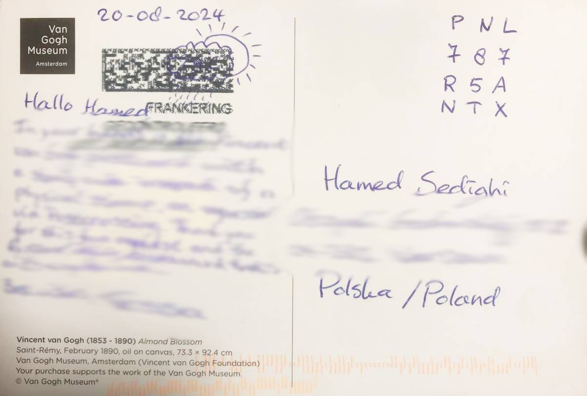

# Postzegelcode Generator

Inspired by a postcard I received from `Netherland` featuring a `postzegelcode`. A 3x3 grid hand-written method of franking in the Netherlands.

For international mail there is a fourth additional row that contains P, N, L.

- [PostNL](https://postnl.nl/versturen/postzegels/postzegels-kopen/postzegelcode)
- [Wikipedia](https://en.wikipedia.org/wiki/Postzegelcode)

